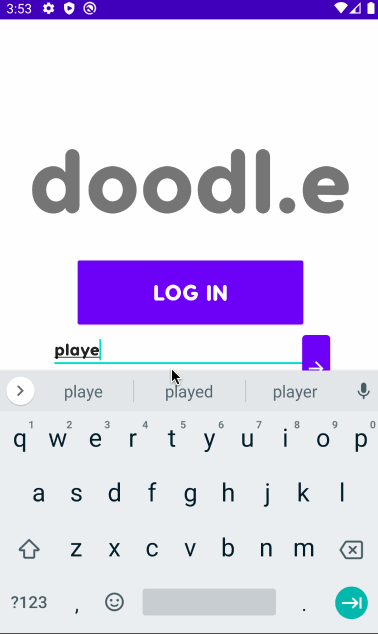

# Doodl.e

## Table of Contents
1. [Overview](#Overview)
2. [Product Spec](#Product-Spec)
3. [Wireframes](#Wireframes)
4. [Schema](#Schema)
5. [Video Walkthroughs](#Video-Walkthroughs)
6. [Credits](#Credits)
7. [Notes](#Notes)
8. [License](#License)

## Overview
### Description
*Doodl.e* is an anonymous collaborative doodling app where you can send out your doodles to the world and contribute to other people's doodles. Get notified whenever your own doodles are contributed to, and watch them evolve. You can also play with your friends in a fun party game.

### App Evaluation
- **Category:** Game/Entertainment/Social
- **Mobile:** Primarily for mobile, but would be possible on a computer. Main functionality of the app (drawing) would be much easier on a touchscreen device.
- **Story:** Users can share doodles and add to other users' doodles.
- **Market:** People who like drawing would enjoy this app, but really anyone who likes a social and anonymous game.
- **Habit:** Users can create and edit as many doodles as they want every day.
- **Scope:** Currently mostly involves doodling, but could be broadened to become more social.

## Product Spec

### 1. User Stories (Required and Optional)

**Required Must-have Stories**

* [x] User can log in
* [x] User can sign up for a new account
* [x] User can logout
* [x] User can choose between Doodle Mode and Game Mode
* [x] User can view their profile
* [x] User can choose to either create a new doodle or contribute to an existing doodle
* [x] User can choose a doodle from a selection of doodles from the database that they've never edited before
  * [x] User can see the timestamp of each doodle in the selection
  * [x] User can view a detail view of each doodle, including the doodle's full history
* [x] User can draw a new doodle
* [x] User can contribute to the doodle that they chose in the contribute screen
* [x] User can undo/redo their strokes
* [x] User can send out their new doodle/contribution to the database
* [ ] User can choose to either create a new game or join an existing game
* [ ] User can create a new game and receive the game code
* [ ] User can join a game by inputting the game code
* [ ] User can view a list of all users currently in the game
* [ ] User who created a game can start the game
* [ ] User can proceed with gameplay similar to Doodle Mode, but confined among the users in the game
* [ ] User can view the full history of each doodle in the game after the game ends
* [ ] User can add their Twitter to allow automatic posting of their doodles
* [x] User can choose to view their gallery
* [x] User can view a gallery of all the doodles they've done
  * [x] User can see the timestamp of each doodle in the gallery
  * [x] User can view a detail view of each doodle, including the doodle's full history
* [ ] User can receive a notification whenever one of their doodles is contributed to

**Optional Nice-to-have Stories**

* [ ] User can choose their drawing color out of a list of colors (previously used colors cannot be chosen)
* [ ] When receiving an existing doodle from the database, user can view a timelapse of the work already done on the doodle

### 2. Screen Archetypes

* Login/Signup Screen
   * User can log in
   * User can sign up for a new account
* Home Screen
   * User can choose between Doodle Mode and Game Mode
   * User can view their profile
   * User can log out
* Doodle Mode Screen
   * User can choose to either create a new doodle contribute to an existing doodle
* Doodle Screen
   * User can draw a new doodle
   * User can contribute to the doodle that they chose in the contribute screen
   * User can send out their new doodle/contribution to the database
   * User can undo/redo their strokes
   * *User can choose their drawing color out of a list of colors (previously used colors cannot be chosen)*
   * *When receiving an existing doodle from the database, user can view a timelapse of the work already done on the doodle*
* Contribute Screen
   * User can choose a doodle from a selection of doodles from the database that they've never edited before
   * User can see the timestamp of each doodle in the selection
   * User can view a detail view of each doodle, including the doodle's full history
* Game Mode Screen
   * User can choose to either create a new game or join an existing game
   * User can create a new game and receive the game code
   * User can join a game by inputting the game code
* Waiting Room Screen
   * User can view a list of all users currently in the game
   * User who created a game can start the game
* Game Screen
   * User can proceed with gameplay similar to Doodle Mode, but confined among the users in the game
   * User can view the full history of each doodle in the game after the game ends
* Profile Screen
   * User can add their Twitter to allow automatic posting of their doodles
   * User can choose to view their gallery
* Gallery Screen
   * User can view a gallery of all the doodles they've done
   * User can see the timestamp of each doodle in the gallery
   * User can view a detail view of each doodle, including the doodle's full history

### 3. Navigation

**Tab Navigation** (Tab to Screen)

* Doodle Mode Screen
   * Create Doodle Tab
   * Add to Doodle Tab
* Game Mode Screen
   * Create Game Tab
   * Join Game Tab

**Flow Navigation** (Screen to Screen)

* Login/Signup Screen
   * Home Screen
* Home Screen
   * Doodle Mode Screen
   * Game Mode Screen
   * Profile Screen
* Doodle Mode Screen
   * none
* Game Mode Screen
   * Game Screen
* Game Screen
   * none
* Profile Screen
   * none

## Wireframes


## Schema 
### Models
#### Doodle

   | Property      | Type     | Description |
   | ------------- | -------- | ------------|
   | objectId      | String   | unique id for the doodle (default field) |
   | createdAt     | DateTime | date when doodle is created (default field) |
   | artist        | Pointer to User| doodle artist |
   | image         | File     | the doodle that the artist posted |
   | parent        | Pointer to Doodle   | the parent to this doodle (null if this doodle has no parent) |
   | tailLength    | Number    | the length of the doodle's "tail" (i.e. how many doodles preceed it, including itself) (if not inGame, Doodle is unable to be randomly received after tailLength reaches 5)|
   | root          | String    | objectId of the root node |
   | inGame        | Boolean   | whether or not the doodle is part of a game (if it is, it cannot be randomly received, and is deleted after the game ends) |
   | *speedDoodle (optional)* | *File* | *data that can be used to recreate a speed-draw of the doodle's past* |
   
#### Game

   | Property      | Type     | Description |
   | ------------- | -------- | ------------|
   | objectId      | String   | unique id for the game (default field) |
   | gameCode      | String   | unique code for the game |
   | players       | Array of Users | users in the game |
   | round         | Number   | current round number (starts at 1) |
   | doodles       | Array of Doodles | doodles submitted in the current round |
   
### Networking
#### List of network requests by screen
   - New Doodle Screen
      - (Create/POST) Create a new doodle object
   - Receive Random Doodle Screen
      - (Read/GET) Recieve a random existing doodle
      - (Create/POST) Create a new doodle object that is the child of the received doodle
   - Create Game Screen
      - (Create/POST) Create new game
        ```java
        Game game = new Game();
        String gameCode = generateRandomCode();
        game.setGameCode(gameCode);
        post.saveInBackground(new SaveCallback() { /* etc... */ });
      - (Read/GET) Get new game
        ```java
        ParseQuery<Game> query = ParseQuery.getQuery(Game.class);
        query.whereEqualTo("gameCode", gameCode);
        query.getFirstInBackground(new GetCallback<ParseObject>() { /* etc... */ });
   - Join Game Screen
      - (Update/PUT) Join game
      - (Read/GET) Get current game data (like current players)
   - Game Screen
      - (Update/PUT) Add new doodle to the game
   - Gallery Screen
      - (Read/GET) Get all doodles you've done
        ```java
        ParseQuery<Doodle> query = ParseQuery.getQuery(Doodle.class);
        query.include(Post.KEY_ARTIST);
        // order posts by creation date (newest first)
        query.addDescendingOrder("createdAt");
   - Profile Screen
      - (Update/PUT) Update username
      - (Update/PUT) Update password
      - (Update/PUT) Update twitter
#### [OPTIONAL:] Existing API Endpoints
##### Twitter API
- Base URL - [https://api.twitter.com/1.1](https://api.twitter.com/1.1)

   HTTP Verb | Endpoint | Description
   ----------|----------|------------
    `POST`   | /statuses/update.json | post new tweet
    
## Video Walkthroughs
### Week 4 Update



GIFs created with [LiceCap](https://www.cockos.com/licecap/).

## Credits

List an 3rd party libraries, icons, graphics, or other assets you used in your app.

- [ExpandableLayout](https://github.com/cachapa/ExpandableLayout) - smooth expanding layouts
- [DrawingView](https://github.com/mukeshsolanki/DrawingView-Android) - drawing and saving doodles
- [BitmapScaler](https://gist.github.com/nesquena/3885707fd3773c09f1bb) - scaling bitmaps


## Notes


## License

    Copyright 2021 Meghan Lin

    Licensed under the Apache License, Version 2.0 (the "License");
    you may not use this file except in compliance with the License.
    You may obtain a copy of the License at

        http://www.apache.org/licenses/LICENSE-2.0

    Unless required by applicable law or agreed to in writing, software
    distributed under the License is distributed on an "AS IS" BASIS,
    WITHOUT WARRANTIES OR CONDITIONS OF ANY KIND, either express or implied.
    See the License for the specific language governing permissions and
    limitations under the License.
